# GigLedger: Class Diagram

**Generated from code, not drawn.** Source: `GigLedger` at commit `f2f234d`. 126 classes in 6 modules.

Regenerate: `python Docs/Scripts/classdiagram.py cs C:/Users/nickt/Desktop/GigLedger/src/GigLedger.Core/GigLedger.Core.csproj C:/Users/nickt/Desktop/GigLedger/src/GigLedger.Data/GigLedger.Data.csproj C:/Users/nickt/Desktop/GigLedger/src/GigLedger.Web/GigLedger.Web.csproj --doc GigLedger --out C:/Users/nickt/Desktop/GigLedger/Docs/GigLedger_Class_Diagram.md`

Arrows: `<|--` inherits, `<|..` implements, `-->` holds a field of that type, `..>` uses it in a method. Links to classes in another diagram are listed under each one.

## GigLedger.Core (1 of 10)

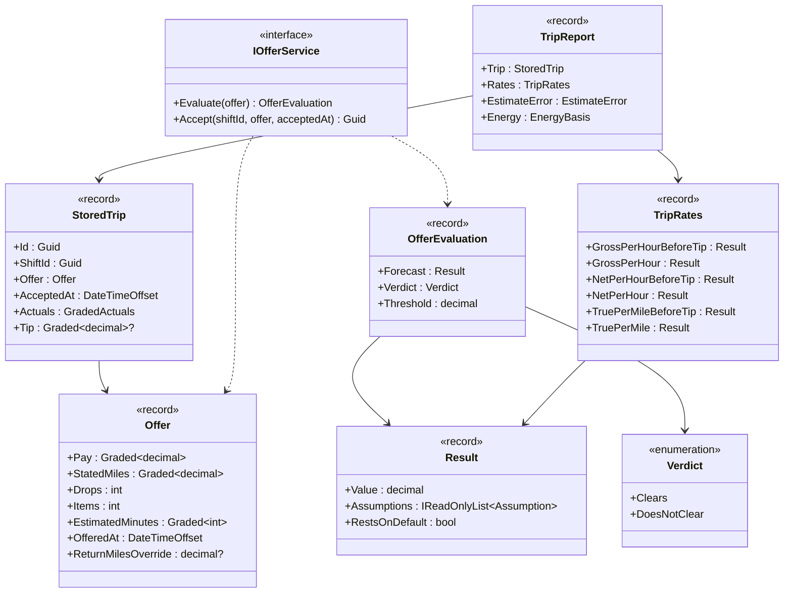

Links outside this diagram:

- AcceptOfferRequest holds Offer (`GigLedger.Web`)
- Calculations uses Offer (`GigLedger.Core`)
- Calculations uses Result (`GigLedger.Core`)
- Calculations uses Verdict (`GigLedger.Core`)
- CostedCharge holds Result (`GigLedger.Core`)
- DeductionMethod holds Result (`GigLedger.Core`)
- EnergyCalculations uses Offer (`GigLedger.Core`)
- EnergyCalculations uses Result (`GigLedger.Core`)
- EnergyCalculations uses TripRates (`GigLedger.Core`)
- EnergyPrices holds Result (`GigLedger.Core`)
- EnergyReport holds Result (`GigLedger.Core`)
- IOfferService is implemented by LedgerServices (`GigLedger.Data`)
- ITripService uses StoredTrip (`GigLedger.Core`)
- ITripService uses TripReport (`GigLedger.Core`)
- LedgerServices uses Offer (`GigLedger.Data`)
- LedgerServices uses OfferEvaluation (`GigLedger.Data`)
- LedgerServices uses StoredTrip (`GigLedger.Data`)
- Offer holds Graded (`GigLedger.Core`)
- PeriodReport holds Result (`GigLedger.Core`)
- Result holds Assumption (`GigLedger.Core`)
- ShiftSummary holds Result (`GigLedger.Core`)
- StoredTrip holds Graded (`GigLedger.Core`)
- StoredTrip holds GradedActuals (`GigLedger.Core`)
- Tax uses Result (`GigLedger.Core`)
- TaxSummary holds Result (`GigLedger.Core`)
- TripReport holds EnergyBasis (`GigLedger.Core`)
- TripReport holds EstimateError (`GigLedger.Core`)

## GigLedger.Core (2 of 10)

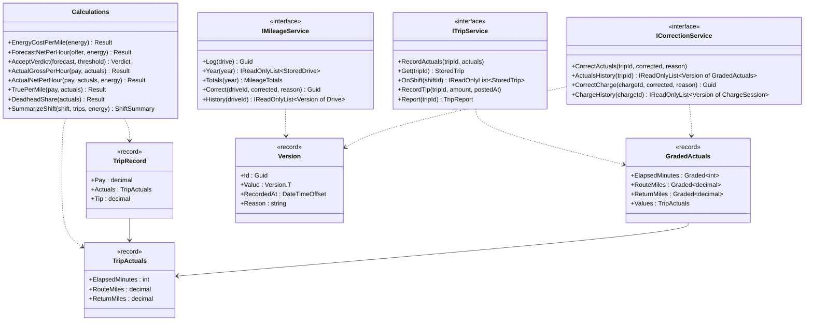

Links outside this diagram:

- Calculations uses EnergyBasis (`GigLedger.Core`)
- Calculations uses Offer (`GigLedger.Core`)
- Calculations uses Result (`GigLedger.Core`)
- Calculations uses ShiftSpan (`GigLedger.Core`)
- Calculations uses ShiftSummary (`GigLedger.Core`)
- Calculations uses Verdict (`GigLedger.Core`)
- CorrectActualsRequest holds GradedActuals (`GigLedger.Web`)
- EnergyCalculations uses TripActuals (`GigLedger.Core`)
- GradedActuals holds Graded (`GigLedger.Core`)
- ICorrectionService is implemented by LedgerServices (`GigLedger.Data`)
- ICorrectionService uses ChargeSession (`GigLedger.Core`)
- IExpenseService uses Version (`GigLedger.Core`)
- IMileageService is implemented by LedgerServices (`GigLedger.Data`)
- IMileageService uses Drive (`GigLedger.Core`)
- IMileageService uses MileageTotals (`GigLedger.Core`)
- IMileageService uses StoredDrive (`GigLedger.Core`)
- ITripService is implemented by LedgerServices (`GigLedger.Data`)
- ITripService uses StoredTrip (`GigLedger.Core`)
- ITripService uses TripReport (`GigLedger.Core`)
- LedgerServices uses GradedActuals (`GigLedger.Data`)
- LedgerServices uses Version (`GigLedger.Data`)
- StoredTrip holds GradedActuals (`GigLedger.Core`)

## GigLedger.Core (3 of 10)

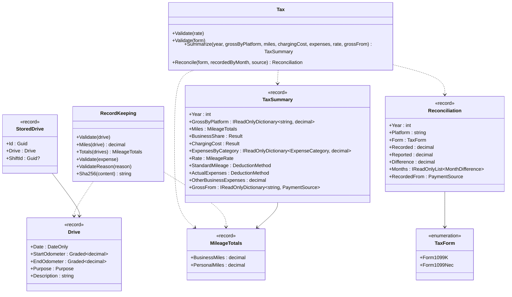

Links outside this diagram:

- CorrectDriveRequest holds Drive (`GigLedger.Web`)
- Drive holds Graded (`GigLedger.Core`)
- Drive holds Purpose (`GigLedger.Core`)
- IMileageService uses Drive (`GigLedger.Core`)
- IMileageService uses MileageTotals (`GigLedger.Core`)
- IMileageService uses StoredDrive (`GigLedger.Core`)
- ITaxService uses Reconciliation (`GigLedger.Core`)
- ITaxService uses TaxSummary (`GigLedger.Core`)
- LedgerServices uses Drive (`GigLedger.Data`)
- LedgerServices uses Reconciliation (`GigLedger.Data`)
- PlatformForm holds TaxForm (`GigLedger.Core`)
- PlatformFormRow holds TaxForm (`GigLedger.Data`)
- Reconciliation holds MonthDifference (`GigLedger.Core`)
- Reconciliation holds PaymentSource (`GigLedger.Core`)
- RecordKeeping uses Expense (`GigLedger.Core`)
- Tax uses Expense (`GigLedger.Core`)
- Tax uses MileageRate (`GigLedger.Core`)
- Tax uses PaymentSource (`GigLedger.Core`)
- Tax uses PlatformForm (`GigLedger.Core`)
- Tax uses Result (`GigLedger.Core`)
- TaxSummary holds DeductionMethod (`GigLedger.Core`)
- TaxSummary holds ExpenseCategory (`GigLedger.Core`)
- TaxSummary holds MileageRate (`GigLedger.Core`)
- TaxSummary holds PaymentSource (`GigLedger.Core`)
- TaxSummary holds Result (`GigLedger.Core`)

## GigLedger.Core (4 of 10)

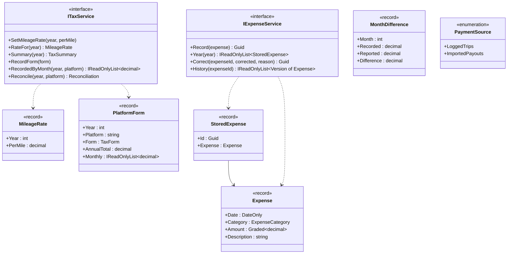

Links outside this diagram:

- CorrectExpenseRequest holds Expense (`GigLedger.Web`)
- Expense holds ExpenseCategory (`GigLedger.Core`)
- Expense holds Graded (`GigLedger.Core`)
- IExpenseService is implemented by LedgerServices (`GigLedger.Data`)
- IExpenseService uses Version (`GigLedger.Core`)
- ITaxService is implemented by LedgerServices (`GigLedger.Data`)
- ITaxService uses Reconciliation (`GigLedger.Core`)
- ITaxService uses TaxSummary (`GigLedger.Core`)
- LedgerServices uses Expense (`GigLedger.Data`)
- LedgerServices uses MileageRate (`GigLedger.Data`)
- LedgerServices uses PlatformForm (`GigLedger.Data`)
- PlatformForm holds TaxForm (`GigLedger.Core`)
- Reconciliation holds MonthDifference (`GigLedger.Core`)
- Reconciliation holds PaymentSource (`GigLedger.Core`)
- RecordKeeping uses Expense (`GigLedger.Core`)
- Tax uses Expense (`GigLedger.Core`)
- Tax uses MileageRate (`GigLedger.Core`)
- Tax uses PaymentSource (`GigLedger.Core`)
- Tax uses PlatformForm (`GigLedger.Core`)
- TaxSummary holds MileageRate (`GigLedger.Core`)
- TaxSummary holds PaymentSource (`GigLedger.Core`)

## GigLedger.Core (5 of 10)

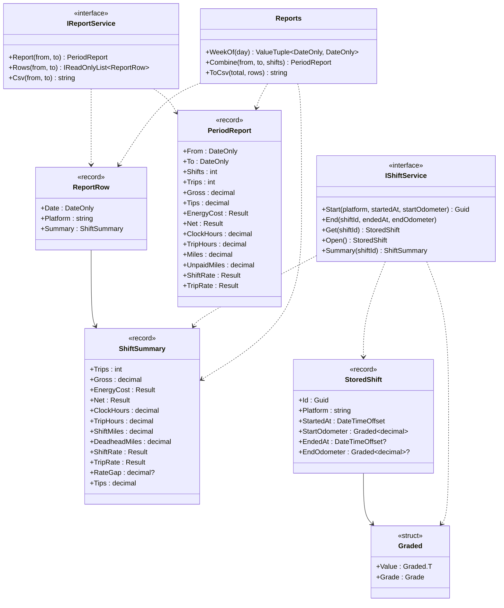

Links outside this diagram:

- Calculations uses ShiftSummary (`GigLedger.Core`)
- ChargeSession holds Graded (`GigLedger.Core`)
- Drive holds Graded (`GigLedger.Core`)
- EndShiftRequest holds Graded (`GigLedger.Web`)
- Expense holds Graded (`GigLedger.Core`)
- Graded holds Grade (`GigLedger.Core`)
- GradedActuals holds Graded (`GigLedger.Core`)
- IReportService is implemented by LedgerServices (`GigLedger.Data`)
- IShiftService is implemented by LedgerServices (`GigLedger.Data`)
- LedgerServices uses Graded (`GigLedger.Data`)
- LedgerServices uses ReportRow (`GigLedger.Data`)
- LedgerServices uses ShiftSummary (`GigLedger.Data`)
- LedgerServices uses StoredShift (`GigLedger.Data`)
- Offer holds Graded (`GigLedger.Core`)
- Payout holds Graded (`GigLedger.Core`)
- PeriodReport holds Result (`GigLedger.Core`)
- ShiftSummary holds Result (`GigLedger.Core`)
- StartShiftRequest holds Graded (`GigLedger.Web`)
- StoredTrip holds Graded (`GigLedger.Core`)

## GigLedger.Core (6 of 10)

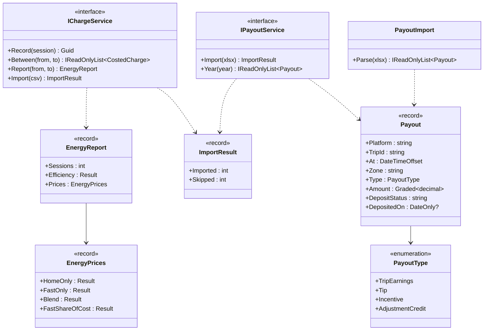

Links outside this diagram:

- EnergyCalculations uses EnergyPrices (`GigLedger.Core`)
- EnergyPrices holds Result (`GigLedger.Core`)
- EnergyReport holds Result (`GigLedger.Core`)
- IChargeService is implemented by LedgerServices (`GigLedger.Data`)
- IChargeService uses ChargeSession (`GigLedger.Core`)
- IChargeService uses CostedCharge (`GigLedger.Core`)
- IPayoutService is implemented by LedgerServices (`GigLedger.Data`)
- LedgerServices uses ImportResult (`GigLedger.Data`)
- Payout holds Graded (`GigLedger.Core`)
- PayoutRow holds PayoutType (`GigLedger.Data`)

## GigLedger.Core (7 of 10)

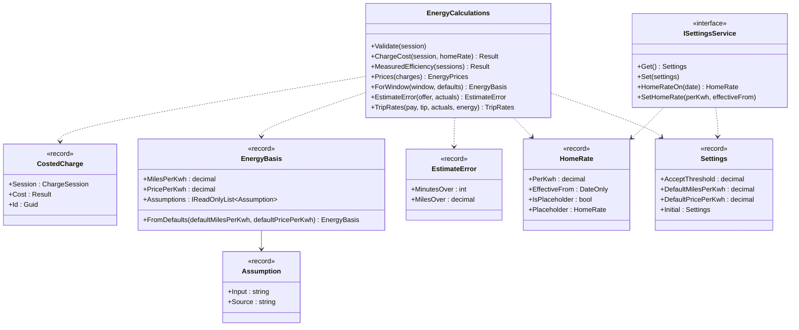

Links outside this diagram:

- Calculations uses EnergyBasis (`GigLedger.Core`)
- CostedCharge holds ChargeSession (`GigLedger.Core`)
- CostedCharge holds Result (`GigLedger.Core`)
- EnergyCalculations uses ChargeSession (`GigLedger.Core`)
- EnergyCalculations uses EnergyPrices (`GigLedger.Core`)
- EnergyCalculations uses Offer (`GigLedger.Core`)
- EnergyCalculations uses Result (`GigLedger.Core`)
- EnergyCalculations uses TripActuals (`GigLedger.Core`)
- EnergyCalculations uses TripRates (`GigLedger.Core`)
- IChargeService uses CostedCharge (`GigLedger.Core`)
- ISettingsService is implemented by LedgerServices (`GigLedger.Data`)
- LedgerServices uses CostedCharge (`GigLedger.Data`)
- LedgerServices uses HomeRate (`GigLedger.Data`)
- LedgerServices uses Settings (`GigLedger.Data`)
- Result holds Assumption (`GigLedger.Core`)
- TripReport holds EnergyBasis (`GigLedger.Core`)
- TripReport holds EstimateError (`GigLedger.Core`)

## GigLedger.Core (8 of 10)

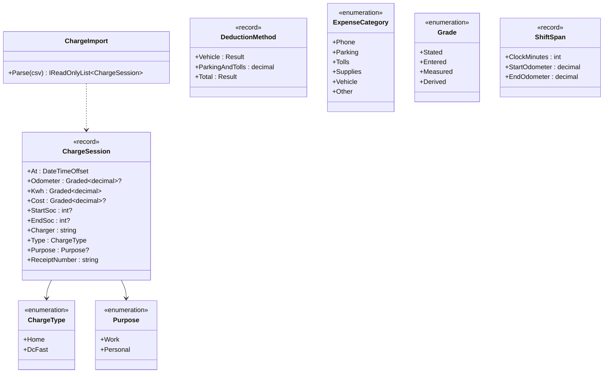

Links outside this diagram:

- Calculations uses ShiftSpan (`GigLedger.Core`)
- ChargeSession holds Graded (`GigLedger.Core`)
- ChargeSessionRow holds ChargeType (`GigLedger.Data`)
- ChargeSessionRow holds Grade (`GigLedger.Data`)
- ChargeSessionRow holds Purpose (`GigLedger.Data`)
- CorrectChargeRequest holds ChargeSession (`GigLedger.Web`)
- CostedCharge holds ChargeSession (`GigLedger.Core`)
- DeductionMethod holds Result (`GigLedger.Core`)
- Drive holds Purpose (`GigLedger.Core`)
- DriveRow holds Grade (`GigLedger.Data`)
- DriveRow holds Purpose (`GigLedger.Data`)
- EnergyCalculations uses ChargeSession (`GigLedger.Core`)
- Expense holds ExpenseCategory (`GigLedger.Core`)
- ExpenseRow holds ExpenseCategory (`GigLedger.Data`)
- ExpenseRow holds Grade (`GigLedger.Data`)
- Graded holds Grade (`GigLedger.Core`)
- IChargeService uses ChargeSession (`GigLedger.Core`)
- ICorrectionService uses ChargeSession (`GigLedger.Core`)
- LedgerServices uses ChargeSession (`GigLedger.Data`)
- PayoutRow holds Grade (`GigLedger.Data`)
- ShiftCloseRow holds Grade (`GigLedger.Data`)
- ShiftRow holds Grade (`GigLedger.Data`)
- TaxSummary holds DeductionMethod (`GigLedger.Core`)
- TaxSummary holds ExpenseCategory (`GigLedger.Core`)
- TipRow holds Grade (`GigLedger.Data`)
- TripActualsRow holds Grade (`GigLedger.Data`)
- TripRow holds Grade (`GigLedger.Data`)

## GigLedger.Core (9 of 10)

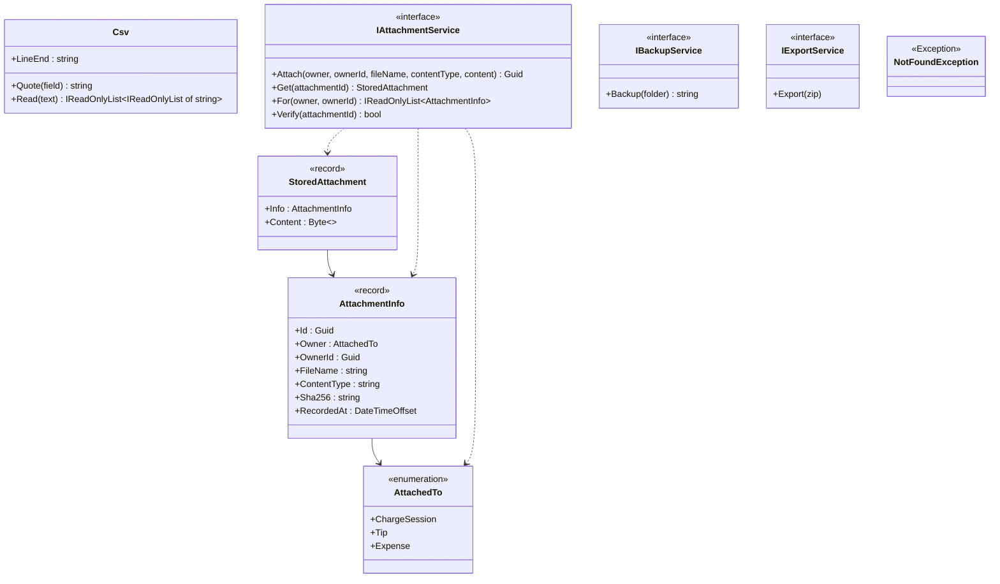

Links outside this diagram:

- AttachRequest holds AttachedTo (`GigLedger.Web`)
- AttachmentRow holds AttachedTo (`GigLedger.Data`)
- IAttachmentService is implemented by LedgerServices (`GigLedger.Data`)
- IBackupService is implemented by LedgerServices (`GigLedger.Data`)
- IExportService is implemented by LedgerServices (`GigLedger.Data`)
- LedgerServices uses AttachedTo (`GigLedger.Data`)
- LedgerServices uses AttachmentInfo (`GigLedger.Data`)

## GigLedger.Core (10 of 10)

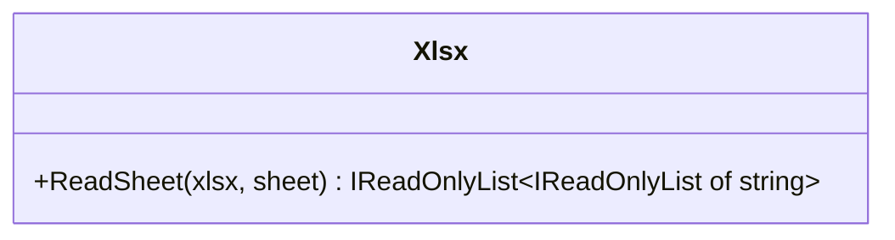

## GigLedger.Data (1 of 3)

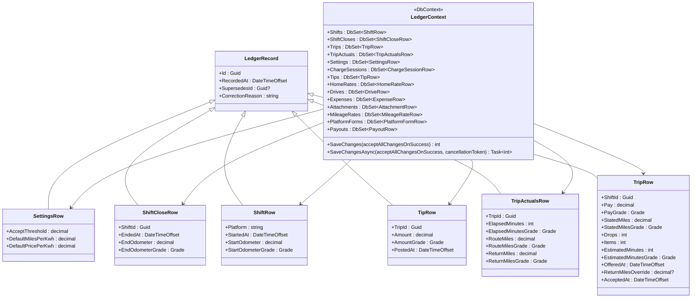

Links outside this diagram:

- LedgerContext holds AttachmentRow (`GigLedger.Data`)
- LedgerContext holds ChargeSessionRow (`GigLedger.Data`)
- LedgerContext holds DriveRow (`GigLedger.Data`)
- LedgerContext holds ExpenseRow (`GigLedger.Data`)
- LedgerContext holds HomeRateRow (`GigLedger.Data`)
- LedgerContext holds MileageRateRow (`GigLedger.Data`)
- LedgerContext holds PayoutRow (`GigLedger.Data`)
- LedgerContext holds PlatformFormRow (`GigLedger.Data`)
- LedgerContextFactory uses LedgerContext (`GigLedger.Data`)
- LedgerDatabase uses LedgerContext (`GigLedger.Data`)
- LedgerRecord is inherited by AttachmentRow (`GigLedger.Data`)
- LedgerRecord is inherited by ChargeSessionRow (`GigLedger.Data`)
- LedgerRecord is inherited by DriveRow (`GigLedger.Data`)
- LedgerRecord is inherited by ExpenseRow (`GigLedger.Data`)
- LedgerRecord is inherited by HomeRateRow (`GigLedger.Data`)
- LedgerRecord is inherited by MileageRateRow (`GigLedger.Data`)
- LedgerRecord is inherited by PayoutRow (`GigLedger.Data`)
- LedgerRecord is inherited by PlatformFormRow (`GigLedger.Data`)
- LedgerServices uses LedgerContext (`GigLedger.Data`)
- ShiftCloseRow holds Grade (`GigLedger.Core`)
- ShiftRow holds Grade (`GigLedger.Core`)
- TipRow holds Grade (`GigLedger.Core`)
- TripActualsRow holds Grade (`GigLedger.Core`)
- TripRow holds Grade (`GigLedger.Core`)

## GigLedger.Data (2 of 3)

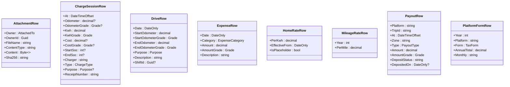

Links outside this diagram:

- AttachmentRow holds AttachedTo (`GigLedger.Core`)
- ChargeSessionRow holds ChargeType (`GigLedger.Core`)
- ChargeSessionRow holds Grade (`GigLedger.Core`)
- ChargeSessionRow holds Purpose (`GigLedger.Core`)
- DriveRow holds Grade (`GigLedger.Core`)
- DriveRow holds Purpose (`GigLedger.Core`)
- ExpenseRow holds ExpenseCategory (`GigLedger.Core`)
- ExpenseRow holds Grade (`GigLedger.Core`)
- LedgerContext holds AttachmentRow (`GigLedger.Data`)
- LedgerContext holds ChargeSessionRow (`GigLedger.Data`)
- LedgerContext holds DriveRow (`GigLedger.Data`)
- LedgerContext holds ExpenseRow (`GigLedger.Data`)
- LedgerContext holds HomeRateRow (`GigLedger.Data`)
- LedgerContext holds MileageRateRow (`GigLedger.Data`)
- LedgerContext holds PayoutRow (`GigLedger.Data`)
- LedgerContext holds PlatformFormRow (`GigLedger.Data`)
- LedgerRecord is inherited by AttachmentRow (`GigLedger.Data`)
- LedgerRecord is inherited by ChargeSessionRow (`GigLedger.Data`)
- LedgerRecord is inherited by DriveRow (`GigLedger.Data`)
- LedgerRecord is inherited by ExpenseRow (`GigLedger.Data`)
- LedgerRecord is inherited by HomeRateRow (`GigLedger.Data`)
- LedgerRecord is inherited by MileageRateRow (`GigLedger.Data`)
- LedgerRecord is inherited by PayoutRow (`GigLedger.Data`)
- LedgerRecord is inherited by PlatformFormRow (`GigLedger.Data`)
- PayoutRow holds Grade (`GigLedger.Core`)
- PayoutRow holds PayoutType (`GigLedger.Core`)
- PlatformFormRow holds TaxForm (`GigLedger.Core`)

## GigLedger.Data (3 of 3)

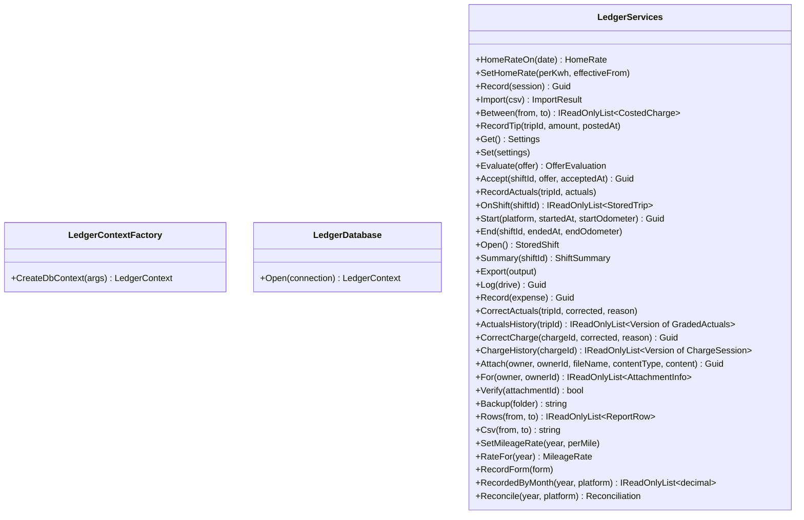

Links outside this diagram:

- IAttachmentService is implemented by LedgerServices (`GigLedger.Core`)
- IBackupService is implemented by LedgerServices (`GigLedger.Core`)
- IChargeService is implemented by LedgerServices (`GigLedger.Core`)
- ICorrectionService is implemented by LedgerServices (`GigLedger.Core`)
- IExpenseService is implemented by LedgerServices (`GigLedger.Core`)
- IExportService is implemented by LedgerServices (`GigLedger.Core`)
- IMileageService is implemented by LedgerServices (`GigLedger.Core`)
- IOfferService is implemented by LedgerServices (`GigLedger.Core`)
- IPayoutService is implemented by LedgerServices (`GigLedger.Core`)
- IReportService is implemented by LedgerServices (`GigLedger.Core`)
- ISettingsService is implemented by LedgerServices (`GigLedger.Core`)
- IShiftService is implemented by LedgerServices (`GigLedger.Core`)
- ITaxService is implemented by LedgerServices (`GigLedger.Core`)
- ITripService is implemented by LedgerServices (`GigLedger.Core`)
- LedgerContextFactory uses LedgerContext (`GigLedger.Data`)
- LedgerDatabase uses LedgerContext (`GigLedger.Data`)
- LedgerServices uses AttachedTo (`GigLedger.Core`)
- LedgerServices uses AttachmentInfo (`GigLedger.Core`)
- LedgerServices uses ChargeSession (`GigLedger.Core`)
- LedgerServices uses CostedCharge (`GigLedger.Core`)
- LedgerServices uses Drive (`GigLedger.Core`)
- LedgerServices uses Expense (`GigLedger.Core`)
- LedgerServices uses Graded (`GigLedger.Core`)
- LedgerServices uses GradedActuals (`GigLedger.Core`)
- LedgerServices uses HomeRate (`GigLedger.Core`)
- LedgerServices uses ImportResult (`GigLedger.Core`)
- LedgerServices uses LedgerContext (`GigLedger.Data`)
- LedgerServices uses MileageRate (`GigLedger.Core`)
- LedgerServices uses Offer (`GigLedger.Core`)
- LedgerServices uses OfferEvaluation (`GigLedger.Core`)
- LedgerServices uses PlatformForm (`GigLedger.Core`)
- LedgerServices uses Reconciliation (`GigLedger.Core`)
- LedgerServices uses ReportRow (`GigLedger.Core`)
- LedgerServices uses Settings (`GigLedger.Core`)
- LedgerServices uses ShiftSummary (`GigLedger.Core`)
- LedgerServices uses StoredShift (`GigLedger.Core`)
- LedgerServices uses StoredTrip (`GigLedger.Core`)
- LedgerServices uses Version (`GigLedger.Core`)

## GigLedger.Web (1 of 3)

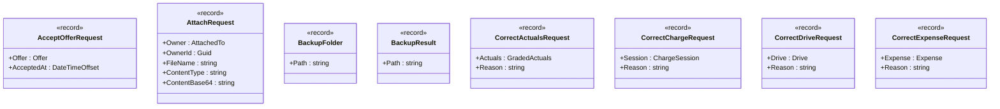

Links outside this diagram:

- AcceptOfferRequest holds Offer (`GigLedger.Core`)
- AttachRequest holds AttachedTo (`GigLedger.Core`)
- CorrectActualsRequest holds GradedActuals (`GigLedger.Core`)
- CorrectChargeRequest holds ChargeSession (`GigLedger.Core`)
- CorrectDriveRequest holds Drive (`GigLedger.Core`)
- CorrectExpenseRequest holds Expense (`GigLedger.Core`)

## GigLedger.Web (2 of 3)

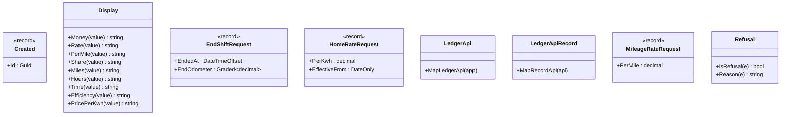

Links outside this diagram:

- EndShiftRequest holds Graded (`GigLedger.Core`)

## GigLedger.Web (3 of 3)

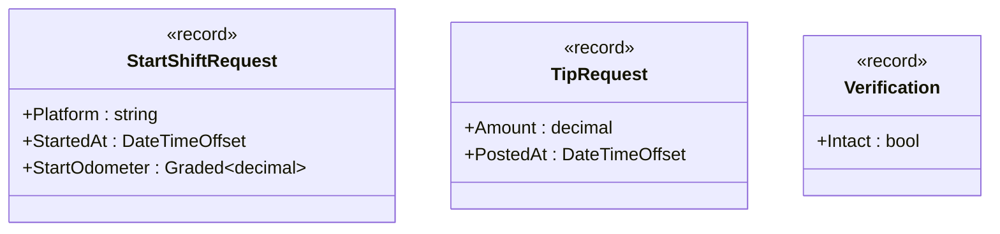

Links outside this diagram:

- StartShiftRequest holds Graded (`GigLedger.Core`)

## GigLedger.Web.Components

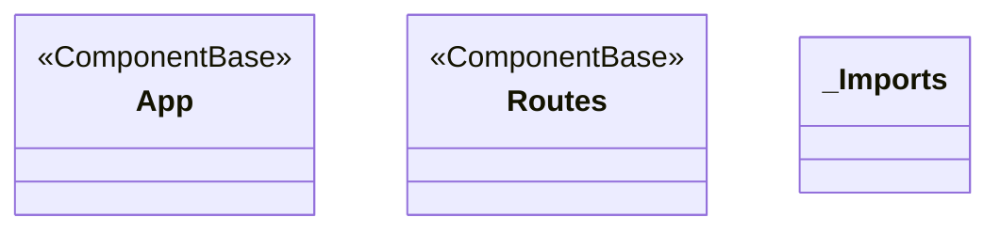

## GigLedger.Web.Components.Layout

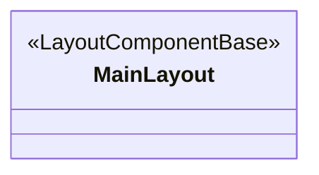

## GigLedger.Web.Components.Pages (1 of 2)

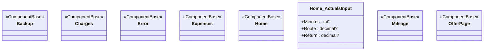

## GigLedger.Web.Components.Pages (2 of 2)

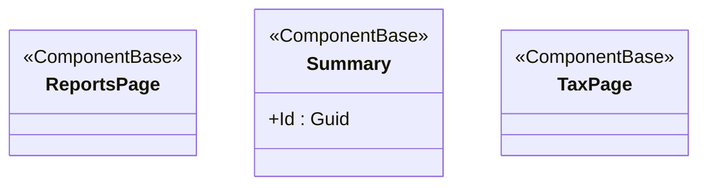
